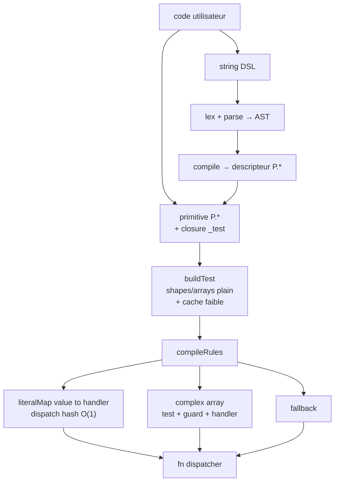

# matchigo-lua

[](https://github.com/SUP2Ak/matchigo-lua/actions/workflows/ci.yml) [](https://img.shields.io/badge/focus-Pattern%20Matching-purple) [](https://img.shields.io/badge/lang-Lua%205.1%2B%20%2F%20LuaJIT-green) [](./LICENSE)

> "Primitives composables, DSL optionnel à la Rust, dispatcher compilé — pour Lua."

📖 [English](./README.md) · Français

[Patterns](./docs/fr/patterns.md) · [Matching](./docs/fr/matching.md) · [DSL](./docs/fr/dsl.md) · [Types](./docs/fr/types.md) · [Exemples](./docs/fr/examples.md)

---

## 🧠 C'est quoi matchigo-lua ?

Un moteur de pattern-matching pour Lua. **Ce projet est le port Lua de mon
propre projet [matchigo](https://github.com/SUP2Ak/matchigo) (TypeScript)** —
même surface `P.*`, même modèle de compile, plus un DSL à la Rust qui comble
le manque syntaxique que Lua n'a pas nativement.

Deux surfaces partagent un seul moteur :

- **Primitives `P.*`** — descripteurs de patterns immutables et composables (`P.string`, `P.between(0, 100)`, `P.tuple(...)`, `P.intersection(...)`).
- **Strings DSL** — match-arms à la Rust (`"{ kind: 'click', x, y } if x > 0"`) parsés une fois, compilés vers les mêmes descripteurs.

```
DSL string ──parse──▶ AST ──compile──▶ descripteur P.* ──┐
                                                          ├──▶ rules ──compile──▶ fn dispatcher
primitive P.* ────────────────────────────────────────────┘
```

Les prédicats de test sont **bakés à la construction** (chaque nœud `P.*` porte son propre closure `_test`). Le compilateur lit `pat._test` directement — pas de table de dispatch centrale, pas de testers/compilers parallèles — et émet un dispatcher spécialisé avec **fast-path hash O(1)** pour les rules à clé littérale.

---

## 🚀 Quickstart

```lua
local m = require("matchigo")
local P = m.P

-- Test unique
m.isMatching(P.string, "hi")            --> true
m.isMatching({ kind = "click" }, evt)   --> evt.kind == "click"

-- Dispatcher compilé (fonction Lua brute — pas de wrapper callable-table)
local route = m.compile({
    { with = "GET",  handler = function() return list_handler   end },
    { with = "POST", handler = function() return create_handler end },
    { otherwise = function() return method_not_allowed end },
})
route("GET")(request)

-- Matcher chainé — passez un scope pour activer le DSL
local handle = m.matcher({ Str = P.string, Num = P.number })
    :with("'GET' | 'POST'",                    function(v) return "method:" .. v end)
    :with("{ user: { age, name } } if age>=18", function(b) return "adulte:" .. b.name end)
    :with("[head, ...tail] if head == 'rm'",   function(b) return rm(b.tail) end)
    :otherwise(                                 function() return nil end)
```

---

## 📦 Install

**Single-file drop-in** (recommandé pour l'embarquer) :

```lua
-- 1. Récupérez dist/matchigo.lua, posez-le sur votre package.path
local m = require("matchigo")

-- 2. Ou chargez-le directement sans toucher au package.path
local m = dofile("dist/matchigo.lua")
```

**Depuis les sources** (recommandé pour développement / contribution) :

```sh
git clone https://github.com/SUP2Ak/matchigo-lua.git
cd matchigo-lua
lua build.lua              # → dist/matchigo.lua (auto-contenu)
lua tests/run.lua          # contre les sources
lua tests/run.lua dist     # contre le bundle
```

Testé sur **Lua 5.1, 5.2, 5.3, 5.4** et **LuaJIT 2.1**. Zéro dépendance externe. Le bundle fait ~2k lignes (≈40 Ko).

---

## 🎯 Avez-vous vraiment besoin d'une lib de pattern-matching ?

Lua a `if/elseif/else` et les chaînes d'égalité directe. Ça marche. C'est rapide. **Vous n'avez pas toujours besoin d'une lib.**

Un moteur de patterns gagne sa place quand :

- **Les unions discriminées explosent** — 3+ niveaux de `if v.kind == ... then if v.target.path:sub(1,5) == ...` deviennent illisibles.
- **Les rules viennent de la donnée** — dispatch piloté par config, plugins, jeux de rules construits au runtime.
- **Destructuring + narrowing en une étape** — extraire `v.user.id` ET vérifier que c'est un entier positif dans un seul shape.
- **Vous voulez une grammaire à la Rust** — le DSL vous donne `[a, b, ...rest] if a > b` directement.

Si votre dispatch est « une string parmi quatre », **restez natif**. Le `if/elseif` natif est 2-3× plus rapide que n'importe quelle lib de matching sur des littéraux simples — il n'y a aucune honte à ça.

Ce README et les [exemples](./docs/fr/examples.md) incluent des comparaisons head-to-head contre des chaînes `if/elseif` et des tables `t[key]` écrites à la main, pour que vous voyiez le coût réel avant d'ajouter une dépendance.

---

## ✨ Features

```lua
-- Sentinels de type
P.string  P.number  P.boolean  P.bigint  P.func
P.nullish  P.defined  P.nonNullable                -- nil / non-nil / alias
P.any                                              -- toujours vrai

-- Prédicats
P.when(fn)
P.instanceOf(mt)
P.luaPattern("^%d+$")                              -- via string.match

-- Refinements Number / BigInt
P.between(0, 10)   P.gt(0)   P.gte(0)   P.lt(100)   P.lte(100)
P.positive   P.negative   P.integer   P.finite
P.bigintGt(n)   P.bigintBetween(min, max)          -- + Gte/Lt/Lte/Positive/Negative

-- Refinements String
P.startsWithStr("admin:")  P.endsWithStr(".lua")  P.includesStr("@")
P.lengthStr(5)  P.minLengthStr(3)  P.maxLengthStr(10)

-- Combinateurs
P.union(...)         -- disjonction de pure values, hash O(1)
P.anyOf(...)         -- disjonction de patterns, walk-style
P.intersection(...)
P.not_(P.string)
P.optional(P.number)

-- Séquences
P.array(P.number)
P.arrayOf(P.number, { min = 1, max = 10 })
P.arrayIncludes(P.string)
P.tuple(P.string, P.number)
P.startsWith(...)  P.endsWith(...)

-- Map / Set (Map ordonnée + Set NaN-safe maison)
P.map(P.string, P.number)
P.set(P.string)

-- Bindings
P.select()                      -- capture anonyme
P.select("label")               -- capture nommée
P.select(P.string)              -- refined anonyme
P.select("label", P.string)     -- refined nommé
```

→ Référence complète des primitives : [`docs/fr/patterns.md`](./docs/fr/patterns.md)

---

## 📝 Le DSL

La feature qui fait la différence côté Lua : une **grammaire de match-arm à la Rust** sous forme de strings, parsée au compile-time et transformée en mêmes descripteurs `P.*`. Pas d'overhead runtime vs un pattern écrit à la main.

Quand le matcher chainé reçoit un `scope` (ou un `ctx`), chaque string passée à `:with(...)` est auto-parsée :

```lua
local scope = {
    User    = { kind = "user" },                           -- shape ref
    Adult   = P.gte(18),                                   -- sentinel ref
    isEmail = function(s) return s:find("@") ~= nil end,   -- prédicat
}

local classify = m.matcher(scope)
    :with("User & { age: Adult, name }",        function(b) return "adulte:" .. b.name end)
    :with("User & { age, name } if age >= 13",  function(b) return "ado:" .. b.name end)
    :with("s if isEmail(s)",                    function(b) return "email:" .. b.s end)
    :with("[head, ...tail]",                    function(b) return "list:" .. b.head end)
    :otherwise(                                 function() return "?" end)
```

Conventions :

| Lexème        | Sens                                                              |
|---------------|-------------------------------------------------------------------|
| `lowercase`   | binding (capture sous ce nom)                                     |
| `PascalCase`  | scope ref (résolu via `scope[name]` au compile-time)              |
| `_`           | wildcard (match tout, pas de capture)                             |
| `$ident`      | interpolation ctx (résolu via `ctx[name]` au compile-time)        |
| `pat if expr` | guard avec un sous-langage d'expressions (and/or/not, ==, +, calls) |
| `[a, ...rest]` / `{x, ...rest}` | destructuring + tail / extra-keys nommé        |

→ Grammaire complète : [`docs/fr/dsl.md`](./docs/fr/dsl.md)

---

## 📊 Architecture



Une seule source de vérité par primitive : `_test` vit sur le descripteur lui-même. `buildTest` ne gère que les shapes plain et les tableaux d'union top-level (les cas où il n'y a pas de descripteur à lire). Le compilateur émet un dispatcher spécialisé par rule list — les rule lists composées uniquement de littéraux s'effondrent en pure hash lookup.

---

## ⚡ Philosophie perf

1. **Tests bakés à la construction.** `P.gt(5)` retourne `{ ..., _test = function(v) return type(v) == "number" and v > 5 end }`. Le compilateur lit `_test` directement. Pas de table de tag-dispatch centrale au call-time.
2. **Dispatch hash O(1) sur littéraux.** Quand chaque `with` est un littéral primitif sans guard / sans select, `compileRules` émet un lookup `literalMap[value] -> handler`. Pas de walk d'arbre au call-time.
3. **Shapes plain cachés.** `buildTest` mémoïse les closures de test par shape via une table à clés faibles (`__mode = "k"`). Le même `{ kind = "click" }` réutilisé sur plusieurs rules paie le coût de construction une seule fois.
4. **Compile lazy.** Le matcher chainé diffère `compileRules` jusqu'au premier appel. Construire un matcher de 50 rules est ~gratuit ; le coût se paie quand vous l'invoquez réellement.
5. **Cache AST pour le DSL.** `parsePattern("'GET' | 'POST'")` parse une fois, stocke l'AST keyed sur la source string, puis re-compile par `(scope, ctx)`. Re-parser la même string est gratuit.

> [!IMPORTANT]
> **matchigo-lua v1.0 ship la version lisible, pas la version max.** Les
> internals actuels privilégient un modèle de compile clair et une
> maintenance simple plutôt que des ns au pic. Les chiffres dans
> [`bench/results/matrix.md`](./bench/results/matrix.md) sont déjà
> raisonnables pour les use cases visés — mais il reste de la marge.
> Les leviers d'optimisation concrets (DSL inline-as-Lua-source, recyclage
> de bindings, aplatissement des wrappers, locals avancées) et les
> conditions pour qu'ils soient shippés sont écrits dans
> [`bench/results/README.md`](./bench/results/README.md#performance-roadmap).
>
> Si vous avez une trace de profiler où l'overhead de matchigo apparaît
> vraiment dans *votre* hot path — ouvrez une issue avec des métriques.
> Le boulot d'optimisation est sur la table s'il y a une preuve que ça
> aiderait quelqu'un. Les "rendez ça plus rapide" génériques recevront
> un poli "envoyez une PR".

---

## 🧬 Projet jumeau : matchigo (TypeScript)

matchigo-lua est le **port Lua de [matchigo](https://github.com/SUP2Ak/matchigo) (TypeScript)** — mon propre projet. La version TS est sortie en premier ; cette version Lua hérite du design, l'adapte aux idiomes Lua, et ajoute un DSL à la Rust pour combler le manque syntaxique.

| Aspect | matchigo (TS) | matchigo-lua |
|---|---|---|
| Surface `P.*` | identique | identique (+ `P.luaPattern`, − `P.regex`/`P.symbol`) |
| Exhaustivité au compile-time | ✅ via les types TS | ❌ (pas de système de types runtime en Lua) |
| Entrée cold-path (`matchWalk`) | ✅ colle au trade-off V8 | benché, n'a jamais battu `compile` — voir note plus bas |
| DSL à la Rust | ❌ (object literals + types natifs) | ✅ — comble le manque syntaxique |
| `BigInt` / `Map` / `Set` | natifs | modules embarqués (Lua n'a pas d'équivalents) |

**Note sur la ligne cold-path** : les deux moitiés de ce trade-off sont spécifiques au runtime. Sur V8, un walker centralisé à tag-dispatch (`matchWalk`) bat l'allocation de closures fresh sur les cold paths — ça mérite sa place. Sur le VM Lua (PUC + LuaJIT) les closures sont cheap et le dispatch par table aussi, donc toutes les variantes cold-path qu'on a benchées contre `compile` ont perdu. Symétriquement, porter le baking `_test` par nœud de Lua vers TS n'apporterait rien — les hidden classes et les inline caches de V8 gèrent le dispatch mieux qu'un closure par nœud ne le ferait. Chaque port choisit le design qui gagne sur son runtime ; aucune approche n'est universellement meilleure.

> 🤝 **Et honnêtement — c'est au dev de réfléchir.** Aucun README (celui-ci compris), aucun tableau de bench, aucun inconnu sur internet ne choisira le bon outil pour *votre* code. Adaptez le design à votre runtime, à la bande passante mentale de votre équipe, et à la version semi-réveillée de vous qui relira ça dans six mois. matchigo-lua est une option ; le `if/elseif` natif en est une autre ; parfois la bonne réponse est aucune des deux. Pas de rancune si la lib ne vous convient pas — vraiment.

---

## 🛠️ Build & tests

```sh
lua build.lua                # → dist/matchigo.lua (single-file auto-contenu)
lua tests/run.lua            # suite de tests contre les sources
lua tests/run.lua dist       # même suite contre le bundle
```

---

## 💡 Philosophie

- Une seule source de vérité par pattern (le closure `_test` sur le descripteur lui-même).
- Le compilateur consomme de la donnée ; il ne re-implémente jamais la sémantique.
- Payez ce que vous utilisez : rules littérales → hash ; rules structurelles → walk ; DSL → AST caché.
- Les chaînes `if/elseif` natives et les tables `t[key]` existent pour de bonnes raisons. On prouve notre valeur, on ne la suppose pas.

---

## ❤️ Support

Si matchigo-lua vous aide :

👉 [Star le repo](https://github.com/SUP2Ak/matchigo-lua) · [Ouvrir une issue](https://github.com/SUP2Ak/matchigo-lua/issues) · [Projet jumeau (TypeScript)](https://github.com/SUP2Ak/matchigo)

---

## 📜 Licence

[**MIT**](./LICENSE) — Copyright (c) 2026 Wesley Cormier (SUP2Ak).
