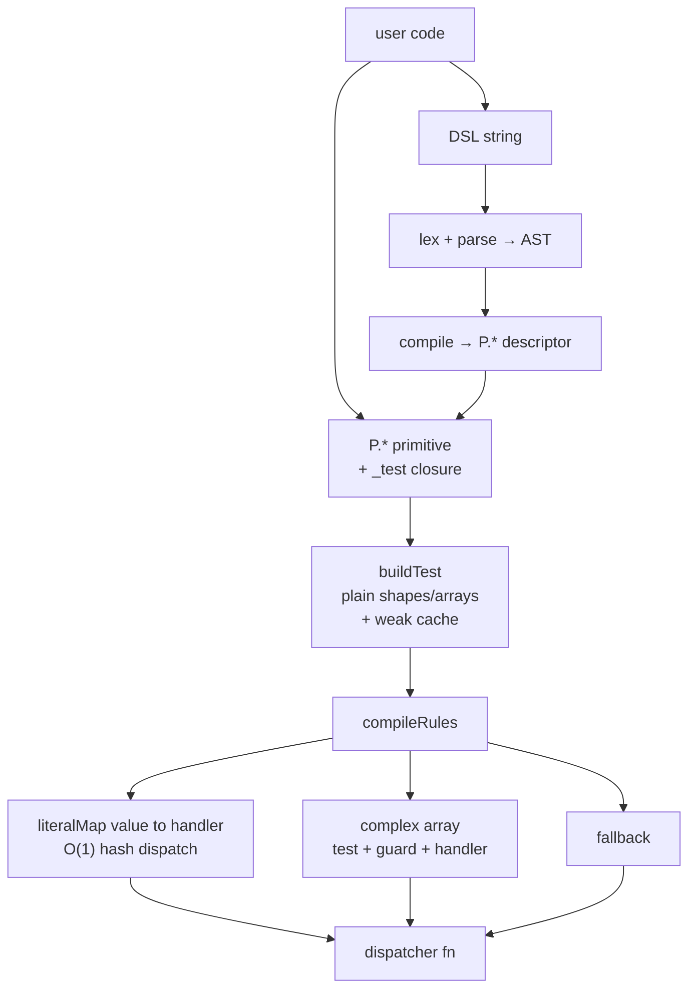

# matchigo-lua

[](https://github.com/SUP2Ak/matchigo-lua/actions/workflows/ci.yml) [](https://img.shields.io/badge/focus-Pattern%20Matching-purple) [](https://img.shields.io/badge/lang-Lua%205.1%2B%20%2F%20LuaJIT-green) [](./LICENSE)

> "Composable pattern primitives, an optional Rust-like DSL, and a compiled dispatcher — for Lua."

📖 English · [Français](./README.fr.md)

[Patterns](./docs/en/patterns.md) · [Matching](./docs/en/matching.md) · [DSL](./docs/en/dsl.md) · [Types](./docs/en/types.md) · [Examples](./docs/en/examples.md)

---

## 🧠 What is matchigo-lua?

A pattern-matching engine for Lua. **This project is the Lua port of my own
[matchigo](https://github.com/SUP2Ak/matchigo) (TypeScript)** — same `P.*`
surface, same compile model, plus a Rust-style DSL that fills the syntactic
gap Lua doesn't cover natively.

Two surfaces share one engine:

- **`P.*` primitives** — immutable, composable pattern descriptors (`P.string`, `P.between(0, 100)`, `P.tuple(...)`, `P.intersection(...)`).
- **DSL strings** — Rust-style match arms (`"{ kind: 'click', x, y } if x > 0"`) parsed once, compiled to the same descriptors.

```
DSL string ──parse──▶ AST ──compile──▶ P.* descriptor ──┐
                                                         ├──▶ rules ──compile──▶ dispatcher fn
P.* primitive ───────────────────────────────────────────┘
```

Test predicates are **baked at pattern construction** (every `P.*` node carries its own `_test` closure). The compiler reads `pat._test` directly — no central dispatch table, no parallel testers/compilers — and emits a specialized dispatcher with an **O(1) hash fast-path** for literal-keyed rules.

---

## 🚀 Quickstart

```lua
local m = require("matchigo")
local P = m.P

-- Single predicate
m.isMatching(P.string, "hi")            --> true
m.isMatching({ kind = "click" }, evt)   --> evt.kind == "click"

-- Compiled dispatcher (raw Lua function — no callable-table wrapper)
local route = m.compile({
    { with = "GET",  handler = function() return list_handler   end },
    { with = "POST", handler = function() return create_handler end },
    { otherwise = function() return method_not_allowed end },
})
route("GET")(request)

-- Chained matcher — pass a scope to enable the DSL
local handle = m.matcher({ Str = P.string, Num = P.number })
    :with("'GET' | 'POST'",                    function(v) return "method:" .. v end)
    :with("{ user: { age, name } } if age>=18", function(b) return "adult:" .. b.name end)
    :with("[head, ...tail] if head == 'rm'",   function(b) return rm(b.tail) end)
    :otherwise(                                 function() return nil end)
```

---

## 📦 Install

**Single-file drop-in** (recommended for embedding):

```lua
-- 1. Grab dist/matchigo.lua, place it on your package.path
local m = require("matchigo")

-- 2. Or load it directly without touching package.path
local m = dofile("dist/matchigo.lua")
```

**From source** (recommended for development / contribution):

```sh
git clone https://github.com/SUP2Ak/matchigo-lua.git
cd matchigo-lua
lua build.lua              # → dist/matchigo.lua (auto-contained)
lua tests/run.lua          # against the source tree
lua tests/run.lua dist     # against the bundle
```

Tested on **Lua 5.1, 5.2, 5.3, 5.4** and **LuaJIT 2.1**. Zero external dependencies. The bundled file is ~2k lines (≈40 KB).

---

## 🎯 Do you even need a pattern matching library?

Lua has `if/elseif/else` and direct equality chains. They work. They're fast. **You don't always need a library.**

A pattern engine earns its keep when:

- **Discriminated unions explode** — 3+ levels of `if v.kind == ... then if v.target.path:sub(1,5) == ...` get unreadable.
- **Rules come from data** — config-driven dispatch, plugin systems, rule sets built at runtime.
- **Destructuring + narrowing in one step** — pull out `v.user.id` AND check it's a positive integer in one shape.
- **You want a Rust-like grammar** — the DSL gives you `[a, b, ...rest] if a > b` directly.

If your dispatch is "one of four strings", **stay native**. Native `if/elseif` is 2–3× faster than any matching library on simple literals — there's no shame in it.

This README and the [examples](./docs/en/examples.md) include head-to-head comparisons against `if/elseif` and `switch`-equivalent dispatches so you can see the real cost before adding a dependency.

---

## ✨ Features

```lua
-- Type sentinels
P.string  P.number  P.boolean  P.bigint  P.func
P.nullish  P.defined  P.nonNullable                -- nil / non-nil / alias
P.any                                              -- always true

-- Predicates
P.when(fn)
P.instanceOf(mt)
P.luaPattern("^%d+$")                              -- string.match-based

-- Number / BigInt refinements
P.between(0, 10)   P.gt(0)   P.gte(0)   P.lt(100)   P.lte(100)
P.positive   P.negative   P.integer   P.finite
P.bigintGt(n)   P.bigintBetween(min, max)          -- + Gte/Lt/Lte/Positive/Negative

-- String refinements
P.startsWithStr("admin:")  P.endsWithStr(".lua")  P.includesStr("@")
P.lengthStr(5)  P.minLengthStr(3)  P.maxLengthStr(10)

-- Combinators
P.union(...)         -- pure-value disjunction, hash O(1)
P.anyOf(...)         -- pattern disjunction, walk-style
P.intersection(...)
P.not_(P.string)
P.optional(P.number)

-- Sequences
P.array(P.number)
P.arrayOf(P.number, { min = 1, max = 10 })
P.arrayIncludes(P.string)
P.tuple(P.string, P.number)
P.startsWith(...)  P.endsWith(...)

-- Map / Set (matchigo's own ordered Map + NaN-safe Set)
P.map(P.string, P.number)
P.set(P.string)

-- Bindings
P.select()                      -- anonymous capture
P.select("label")               -- named capture
P.select(P.string)              -- refined anonymous
P.select("label", P.string)     -- refined named
```

→ Full primitive reference: [`docs/en/patterns.md`](./docs/en/patterns.md)

---

## 📝 The DSL

The killer feature on the Lua side: a **Rust-style match-arm grammar** as plain strings, parsed at compile-time and turned into the same `P.*` descriptors. No runtime overhead vs hand-written patterns.

When the chained matcher receives a `scope` (or `ctx`), every string `:with(...)` is auto-parsed:

```lua
local scope = {
    User    = { kind = "user" },                           -- shape ref
    Adult   = P.gte(18),                                   -- sentinel ref
    isEmail = function(s) return s:find("@") ~= nil end,   -- predicate
}

local classify = m.matcher(scope)
    :with("User & { age: Adult, name }",        function(b) return "adult:" .. b.name end)
    :with("User & { age, name } if age >= 13",  function(b) return "teen:" .. b.name end)
    :with("s if isEmail(s)",                    function(b) return "email:" .. b.s end)
    :with("[head, ...tail]",                    function(b) return "list:" .. b.head end)
    :otherwise(                                 function() return "?" end)
```

Conventions:

| Lexeme        | Meaning                                                          |
|---------------|------------------------------------------------------------------|
| `lowercase`   | binding (capture under that name)                                |
| `PascalCase`  | scope ref (resolved via `scope[name]` at compile-time)           |
| `_`           | wildcard (match anything, no capture)                            |
| `$ident`      | ctx interpolation (resolved via `ctx[name]` at compile-time)     |
| `pat if expr` | guard with a sub-expression language (and/or/not, ==, +, calls)  |
| `[a, ...rest]` / `{x, ...rest}` | destructuring + named tail / extra-keys     |

→ Full grammar: [`docs/en/dsl.md`](./docs/en/dsl.md)

---

## 📊 Architecture



Single source of truth per primitive: `_test` lives on the descriptor itself. `buildTest` only handles plain shapes and top-level array unions (the cases where there is no descriptor to read from). The compiler emits one specialised dispatcher per rule list — literal-only rule lists collapse to a pure hash lookup.

---

## ⚡ Performance philosophy

1. **Tests baked at construction.** `P.gt(5)` returns `{ ..., _test = function(v) return type(v) == "number" and v > 5 end }`. The compiler reads `_test` directly. No switch-on-tag at dispatch time.
2. **O(1) literal Map dispatch.** When every `with` is a primitive literal with no guard / no select, `compileRules` emits a `literalMap[value] -> handler` lookup. No tree walk at call time.
3. **Plain shapes are cached.** `buildTest` memoizes per-shape test closures via a weak-keyed table (`__mode = "k"`). The same `{ kind = "click" }` reused across rules pays the construction cost once.
4. **Lazy compile.** The chained matcher defers `compileRules` until the first dispatch call. Building a 50-rule matcher is ~free; the cost is paid only when you actually invoke it.
5. **AST cache for the DSL.** `parsePattern("'GET' | 'POST'")` parses once, stores the AST keyed on the source string, then re-compiles per `(scope, ctx)`. Re-parsing the same string is free.

---

## 🧬 Sibling project: matchigo (TypeScript)

matchigo-lua is the **Lua port of [matchigo](https://github.com/SUP2Ak/matchigo) (TypeScript)** — my own project. The TS version came first ; this Lua version inherits the design, adapts it to Lua idioms, and adds a Rust-style DSL to fill the syntactic gap.

| Aspect | matchigo (TS) | matchigo-lua |
|---|---|---|
| `P.*` surface | identical | identical (+ `P.luaPattern`, − `P.regex`/`P.symbol`) |
| Compile-time exhaustiveness | ✅ via TS types | ❌ (no runtime types in Lua) |
| Cold-path entry (`matchWalk`) | ✅ matches the V8 trade-off | benched, never beat `compile` — see note below |
| Rust-like DSL | ❌ (native object literals + types) | ✅ — fills the syntactic gap |
| `BigInt` / `Map` / `Set` | natives | shipped modules (Lua has no equivalents) |

**Note on the cold-path row** : both halves of this trade-off are runtime-specific. On V8, a big-switch dispatcher in `matchWalk` beats fresh closure allocation on cold paths — it earns its place. On the Lua VM (PUC + LuaJIT) closures are cheap and table dispatch is cheap, so every cold-path variant we benched against `compile` lost. Symmetrically, porting Lua's per-node `_test` baking back into TS would gain nothing — V8's hidden classes and inline caches handle the dispatch better than a per-node closure would. Each port picks the design that wins on its runtime ; neither approach is universally better.

> 🤝 **And honestly — the dev still has to think.** No README (this one included), no bench table, no random internet stranger is going to pick the right tool for *your* code. Match the design to your runtime, your team's brain bandwidth, and the half-asleep version of you who'll re-read this in six months. matchigo-lua is one option ; native `if/elseif` is another ; sometimes the right answer is neither. No hard feelings if the lib isn't the fit — promise.

---

## 🛠️ Build & tests

```sh
lua build.lua                # → dist/matchigo.lua (single self-contained file)
lua tests/run.lua            # run the test suite against the source tree
lua tests/run.lua dist       # same suite against the bundle
```

---

## 💡 Philosophy

- One source of truth per pattern (the `_test` closure on the descriptor itself).
- The compiler consumes data; it never re-implements semantics.
- Pay for what you use: literal-only rules → hash; structural rules → walk; DSL → AST cached.
- Native `switch`/`if-elseif` exists for a reason. We prove our value, we don't assume it.

---

## ❤️ Support

If matchigo-lua helps you:

👉 [Star the repo](https://github.com/SUP2Ak/matchigo-lua) · [Open an issue](https://github.com/SUP2Ak/matchigo-lua/issues) · [Sibling project (TypeScript)](https://github.com/SUP2Ak/matchigo)

---

## 📜 License

[**MIT**](./LICENSE) — Copyright (c) 2026 Wesley Cormier (SUP2Ak).
